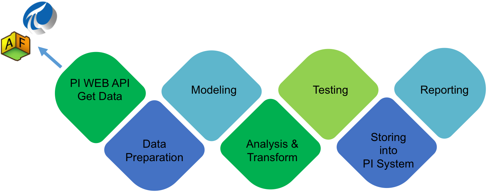

# Data Exploration for PI System

## Objectives

The project around PI System must be considered as Data Driven Projects.

The functional team is not fully qualified to test the data delivery by its own.
It needs help to challenge the data quality.
It needs some Continuous Control Monitoring.
It need to accept and integrate the failure!

## Process Representation

## Prerequeries

1. Install [Anaconda](https://www.anaconda.com/download/)

1. conda create --name dataexploration matplotlib pandas.

1. An accessible up and running PI System with PI WEB-API.

1. PI WEB-API should be configured for a basic authentication (username/password).

1. The conf/credentials.yml has not been pushed for a security reason. Therefore, a conf/credentials.yaml.template is added to copy and rename to conf/credentials.yml with a username/password basic authentication.

### Dependencies

* [PI-Web-API-Client-Python](https://github.com/osimloeff/PI-Web-API-Client-Python)  – PI Client for Python
* csv - Read CSV files
* pandas - Work with data structure like missed Data
* numpy - perform calculations over Data

## Data Exploration description

This model consists of several steps/scripts.

### Data Preparation `clean.py`

This script cleans and pre process the data from your sensor values,before doing any task you have to format your file from this script.
*Before executing this script you will have to add date time value on the top row of your file with spaces otherwise it won't work*

### Decision Tree Model `classify.py`

This script consists of unsupervised decision tree model to classify your time-serie values.

*It generates a file named leak.csv with values having leaks.*

### Generate some missing data `autofill.py`

Pass a csv file with "**date time value**" format, this script will identify the frequency and then generate the missing rows in a csv file **autofill-output.csv** so that you can fill the values and merge them

### Merge two files together `merger.py`

This script will take two csv file with  "`date time value`" format and add the filled values in the orignal file on the recquired place
